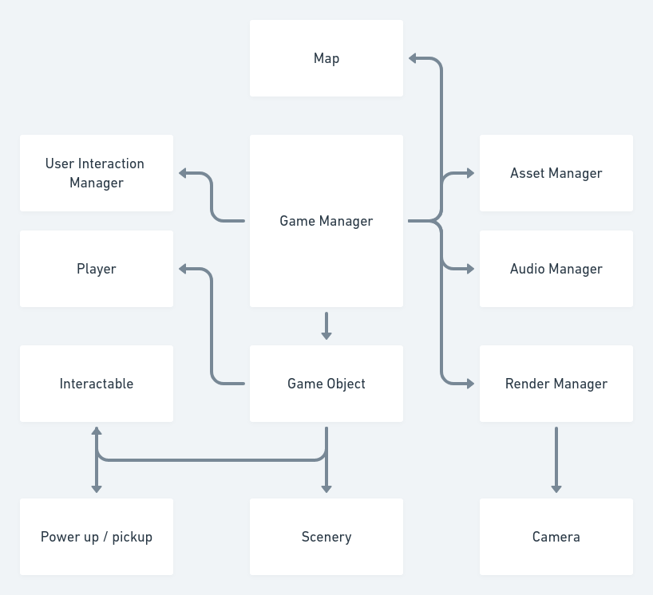

# Super BMX Bash
<div align="center">


</div>

A collaborative project for the Code Institute's August Hackathon, with a retro game theme.

## Introduction

*** 

Super BMX bash is a retro style game where the aim of the game is to get around the track as quickly as possible.  
There are items on the course which help or hinder you on your way.

## Design and planning

***

### User Stories

- As a user I want to be entertained with a working retro game
- As a user I need to understand how to play the game
- As a user I want an element of competitiveness

### Game Operation

<details>
<summary>Click to reveal</summary>



</details>

- Game Manager:  
    Controls game start and end. Creates the other objects, runs the game loop. This is where we'll probably want to place higher level game logic like win/lose condition, score, timing and interaction with the back-end for leaderboard etc.  
- Asset Manager:  
    Loads, stores and manages any resource files (sounds, level data, images). Game Objects would hold a reference to their resource, and give that to the audio/render manager for playing drawing.   
- Audio Manager:  
    Generates or plays sounds and audio files.  
- Render Manager:  
    Encapsulates drawing to the screen.  
- Camera:  
    Defines the player view in the game world. It will generate the information the Render Manager will use to do the actual drawing.  
- Map:  
    Stores information on the current level. Either this or the Asset Manager can load the level definition. May be better for the Game Manager to do, as it can load the required level objects as well.  
- User Interaction Manager:  
    This is where the event listeners will live. The event listeners won't perform any function themselves. They'll log the interaction and then the Update cycle will do the work of changing any states. You can see this paradigm in the mode7 demo. When the user presses a key it just sets a variable. When the update happens that variable is used to change state, be it turning the camera, moving backwards or forwards or jumping.  
- Game Object:  
    Base class for any entity in the game world. The player, items and scenery will derive from this, and any core functionality that all game objects need will be written here, collision detection for instance.  
- Player:  
    The users avatar. Represents the user in the game world.  
- Interactable:  
    Any non player object that can change the player state beyond collision. Buttons, springs, power ups etc would be based on this. May not be needed.  
- Pick ups:  
     Anything the player can pickup and changes their state.
- Scenery:  
    Anything that doesn't really do anything but can be collided with. Like a tree for instance.


## Technologies used

***

- CSS framework for web page design: https://nostalgic-css.github.io/NES.css/#  
    Only offers styling no alignment etc.
- Font Awesome for instruction icons


## File Structure

```
.
├── assets
    ├── css: All style files.
    ├── Js: All JS files.
        ├── modules
    ├── img: All images
        ├── objects
        ├── sprites
        ├── team
        ├── tracks
├── readme: Assets for README.md
├── index.html
├── game.html
├── about.html
├── README.md
```